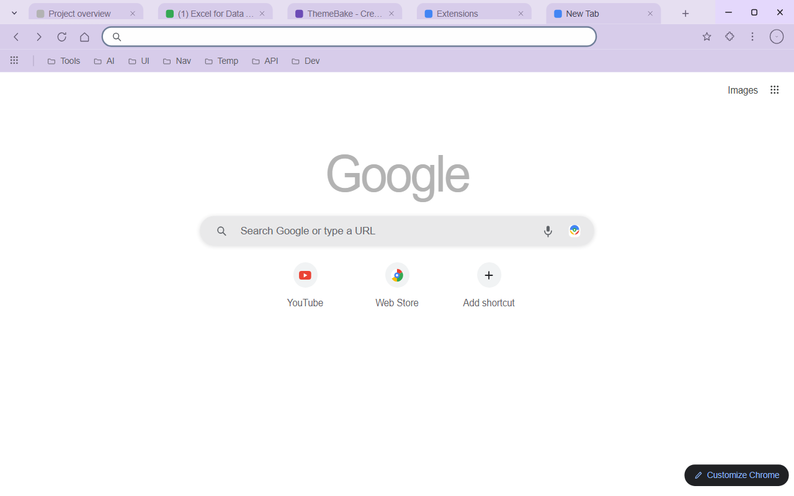
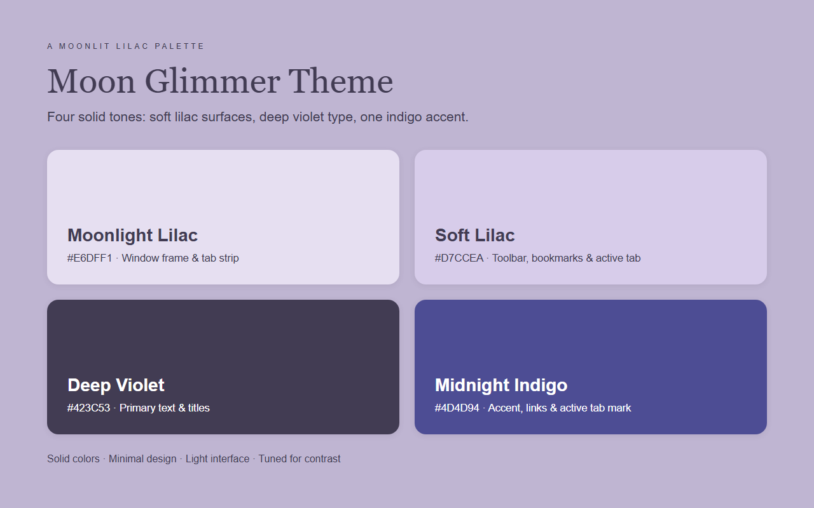

  

<h1 align="center">Moon Glimmer Theme</h1>

A light lilac Chrome theme: soft lavender surfaces, deep violet type, and one midnight indigo accent.

  
  

## About

Moon Glimmer keeps the browser in a soft, moonlit key. A pale lavender frame and tab strip sit above a slightly deeper lilac toolbar, and the new tab page stays a clean light surface that keeps the page you are reading in focus. Deep violet labels carry every text layer, so titles, bookmarks and the address bar all stay readable on their own surface, and a single midnight indigo accent ties together links, the active tab mark and the store artwork.

Every surface is a flat, single solid color. The palette lives entirely in the theme definition, so installing it simply recolors the browser.

## Color Palette

| Token | Hex | Usage |
|-------|-----|-------|
| Moonlight Lilac | `#E6DFF1` | Window frame & tab strip |
| Soft Lilac | `#D7CCEA` | Toolbar, bookmark bar & active tab |
| Deep Violet | `#423C53` | Tab titles & primary text |
| Muted Violet | `#6F6581` | Inactive tab, toolbar & bookmark text |
| Midnight Indigo | `#4D4D94` | Accent, links & active tab mark |
| Light Surface | `#F8F8F9` | New tab background |

## Chrome UI Notes

Some parts of the browser are painted by Chrome itself, not by the theme manifest. The store screenshots follow what Chrome renders on this light new-tab page:

- **Google mark on the new tab page:** with `ntp_logo_alternate` enabled, Chrome paints the wordmark in a single neutral tone derived from the new-tab background instead of the four-color brand logo.
- **New tab search box:** Chrome renders it as a white pill with a soft shadow on the light page, with grey glyphs and the Lens icon in its own brand colors.
- **Shortcut tiles:** the round new-tab shortcut buttons keep their own light grey tiles for YouTube, the Chrome Web Store and the add-shortcut button.
- **Window buttons:** Chrome keeps the minimise, maximise and close glyphs dark against the light frame.
- **Customize Chrome pill:** the dark pill in the lower right corner is rendered by the page, not by the theme.

## Features

- Soft lilac palette with deep violet type for a calm, light workspace.
- Solid color design — every surface is a flat, single tone.
- Contrast tuned for readable tab, toolbar, bookmark and address-bar text.
- A quiet new tab page that keeps attention on the current page.
- Pure theme built from a color definition alone, with no added code or permissions.

## Install

### From source (unpacked)

1. Download or clone this repository.
2. Open Chrome and navigate to `chrome://extensions`.
3. Enable **Developer mode** in the top-right corner.
4. Click **Load unpacked** and select this folder.

### From Chrome Web Store

Search for **Moon Glimmer Theme** in the Chrome Web Store and install it.

## Preview

## Files

| File | Description |
|------|-------------|
| `manifest.json` | Chrome theme manifest (MV3) with inline `theme` config |
| `logo/logo.png` | Chrome Web Store icon (128x128) |
| `store-assets/screenshots/en/` | Store listing screenshots (1280x800) |
| `store-assets/promo/` | Promo tiles (440x280 and 1400x560) |
| `store-assets/store-description.txt` | Store listing detailed description (English) |
| `store-assets/references/browser-real.png` | Real capture used to calibrate the mockup |
| `scripts/generate-logo-options.py` | Draws the icon candidate sheet and exports `logo/logo.png` |
| `scripts/generate-references.py` | Renders every store asset from one HTML/CSS source |
| `scripts/generate-store-assets.py` | Entry point: renders all assets and validates the icon |
| `scripts/sample-reference.py` | Samples the real capture for the calibrated UI tones |
| `scripts/package.py` | Builds the store zip and self-checks it |

## Packaging

See [PACKAGING.md](PACKAGING.md). In short: `python3 scripts/package.py` writes
`dist/moon-glimmer-theme-<version>.zip` and copies the same bytes to the shared
upload folder.

## License

Non-Commercial License — personal use is permitted, commercial use requires permission. See [LICENSE](LICENSE).
